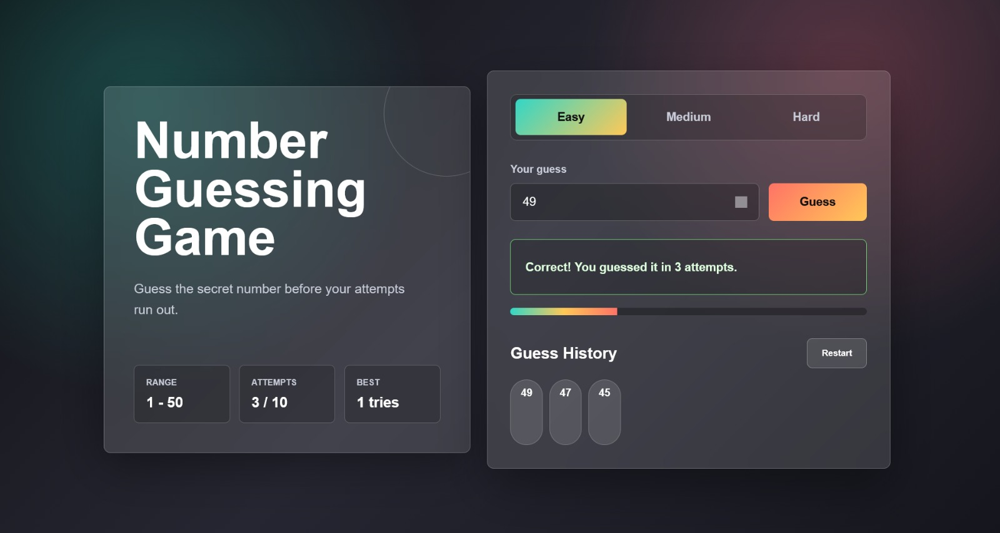

# Number Guessing Game

A responsive Number Guessing Game built using HTML, CSS, and JavaScript. This project was created as part of my Software Development internship task.

## Live Demo

Add your live project link here:

```text
https://your-github-username.github.io/number-guessing-game/

```
About The Project
The Number Guessing Game generates a random number and challenges the user to guess it. After every guess, the app compares the user's input with the generated number and gives feedback such as too high, too low, or correct.

The project includes a modern glassmorphism user interface and interactive game features.

## Features
- Random number generation
- User input validation
- Easy, Medium, and Hard difficulty levels
- Attempt counter
- Guess history
- Restart game option
- Best score saved in the browser
- Responsive glassmorphism UI

## Technologies Used

- HTML
- CSS
- JavaScript

## How To Run The Project

1. Download or clone this repository.
2. Open the project folder.
3. Open the index.html file in any web browser.
4. Start playing the game.

## Project Structure
number-guessing-game/
│
├── index.html
└── README.md

##  How It Works

1. The app generates a random number based on the selected difficulty level.

2. The user enters a guess.

3. The app checks whether the guess is correct, too high, or too low.

4. The attempt count and guess history are updated.

5. The user wins if they guess the correct number before attempts run out.

Difficulty Levels
Level	Number Range	Attempts
Easy	1 - 50	          10
Medium	1 - 100	           8 
Hard	1 - 200	           6

## Screenshot



Author
Your Name

 